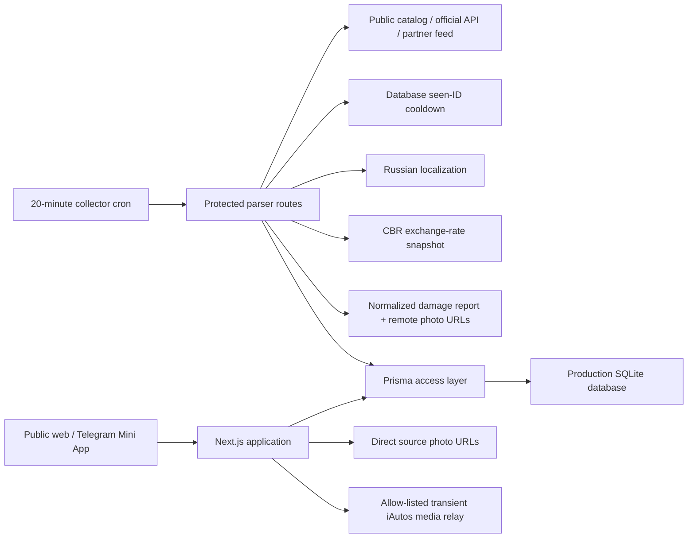
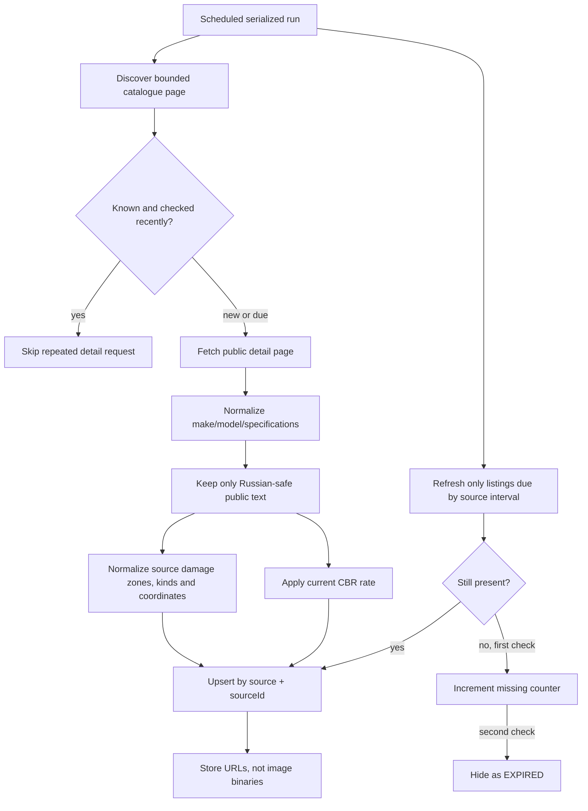
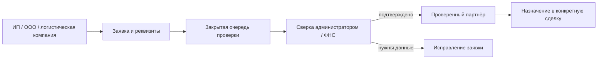

# LeWheel project graph

Read this file before broad searches. Follow only the branch needed for the
current task and update the graph when ownership or data flow changes.

## Runtime graph

## Task routing graph

| Task | Start here | Then inspect |
|---|---|---|
| Auction catalogue UI | `src/app/auctions/page.tsx` | `src/app/api/auctions/route.ts`, auction components |
| Auction detail and galleries | `src/app/auctions/[id]/page.tsx` | `src/lib/auction-media.ts`, source collector |
| Interactive damage report | `src/components/auctions/AuctionDamageReport.tsx` | `auction-damage.ts`, source inspection adapter |
| Admin analytics and charts | `src/app/admin/page.tsx` | `src/app/api/admin/stats/route.ts`, analytics visit route |
| Sidebar/header/footer | `src/components/layout/` | app shell and responsive styles |
| Website authentication | `src/app/auth/` | `src/app/api/auth/`, NextAuth configuration |
| Telegram registration | `scripts/telegram-polling.mjs` | Telegram API routes and user model |
| Auction import | source collector | parser sync/refresh route, `auction-import.ts` |
| Exchange rates | `src/lib/exchange-rates.ts` | CBR refresh script and cron |
| Freshness/removal | source refresh route | `auction-crawl-policy.ts`, `auction-source-freshness.ts`, listing status fields |
| Production schedule | `scripts/run-encar-collector.sh` | cron installer and deployment script |
| Delivery partner onboarding | `src/app/api/delivery-organizations/route.ts` | delivery workspace, admin partner registry |

## Auction ingestion graph

Discovery still scans bounded catalogue pages every 20 minutes so new source
IDs enter immediately. Detail pages already confirmed in the database use a
12–24 hour source-specific cooldown. Availability refresh is separate and uses
3–12 hour source-specific intervals; two spaced missing checks are required
before a listing is hidden. Photos remain source CDN URLs and image binaries are
not persisted in the application database or server filesystem. The iAutos CDN
is unreachable from some client regions, so only its four fixed image hosts use
a bounded, cached, allow-listed relay; bytes are streamed through memory and are
never written to disk.

Structured inspection sources use the shared `AuctionDamageReport` payload.
Native Russian source labels are kept first; deterministic source dictionaries
are used next, and untranslated foreign prose is never published. Only defect
text, normalized coordinates and allow-listed HTTPS URLs are stored. Diagram
and defect image bytes load on demand from the source into the browser cache.
The detail widget navigates across every defect photo in the active inspection
section, even when the selected defect itself has only one photo. Imported lots
with normalized source attributes render the detailed source table as the
single specification block; the compact legacy characteristics grid remains
only as a fallback for listings without source attributes.

## Source inventory

| Region | Source | Pipeline | Operational entry point |
|---|---|---|---|
| Korea | Encar | Public collector | `/api/parser/encar/*` |
| Korea | K Car | Public collector | `/api/parser/kcar/*` |
| Korea | Bobaedream | Public HTML collector | `/api/parser/public/BOBAEDREAM/*` |
| China | Iautos | Public HTML collector | `/api/parser/public/IAUTOS/*` |
| China | YouXinPai export | Public storefront JSON + structured inspection collector | `/api/parser/public/YOUXINPAI/*` |
| Japan | Goo-net Exchange | Public HTML collector | `/api/parser/public/GOONET/*` |
| Japan | BE FORWARD | Public sitemap and HTML collector | `/api/parser/public/BEFORWARD/*` |
| Japan | CarSensor | Public sitemap and HTML collector | `/api/parser/public/CARSENSOR/*` |
| Europe | Carvago | Public HTML collector | `/api/parser/public/CARVAGO/*` |
| Europe | AutoSale | Public sitemap and JSON-LD collector | `/api/parser/public/AUTOSALE/*` |
| Europe | mobile.de | Official API when credentials exist | `/api/parser/mobile-de/*` |
| Other configured sources | Registry entries | Partner feed / official API | `/api/parser/partner-feeds/sync` |

## Source admission checklist

1. Public catalogue and detail pages must be available without login or CAPTCHA.
2. Respect the source's robots policy and do not bypass access controls.
3. Use a bounded serial request rate and the configured proxy pool only.
4. Require stable source ID, price, year, make/model and at least one real photo.
5. Reject customer-visible CJK text unless deterministic localization or a
   verified Russian translation succeeds.
6. Store source currency and use the current CBR snapshot for RUB pricing.
7. Implement both discovery and two-confirmation freshness checks.
8. Add the source to the registry, cron, production health query and this graph.

## Delivery partner verification graph

Подача заявки не назначает компанию на доставку и не открывает ей чужие
сделки. Пользователь видит только собственную заявку; решение фиксируется в
существующем администраторском реестре. Автоматическая отметка ФНС допустима
только после ответа подтверждённого источника, иначе используется ручная
проверка.
