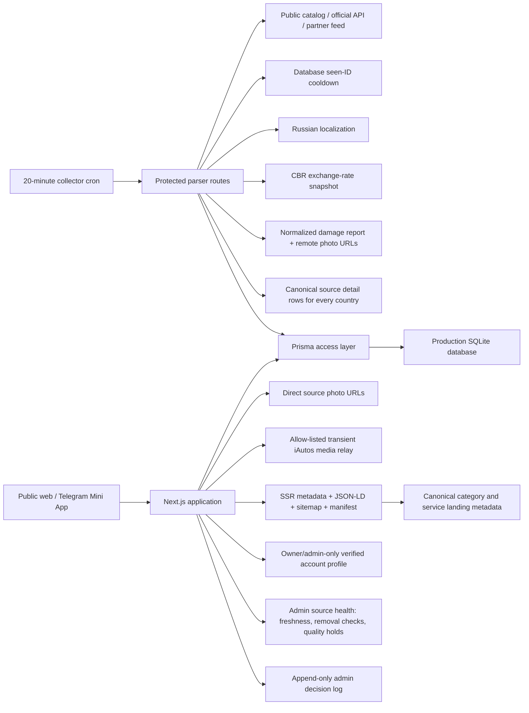
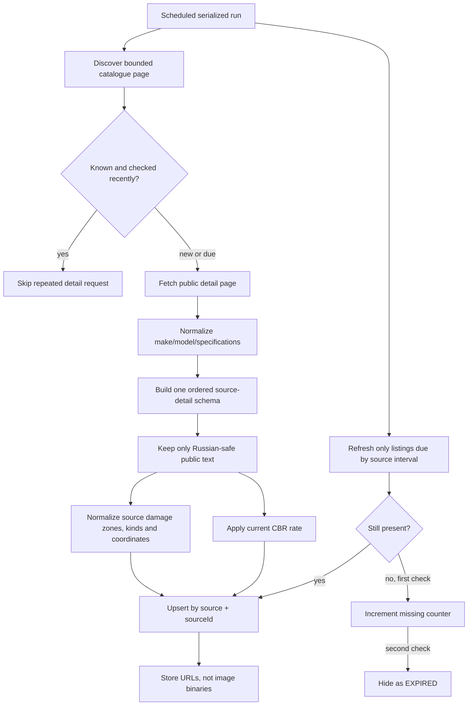
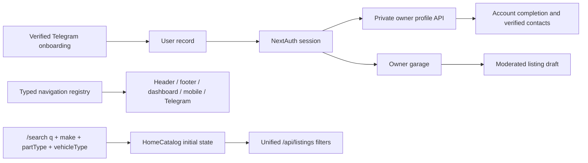
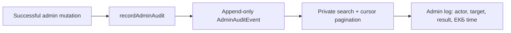
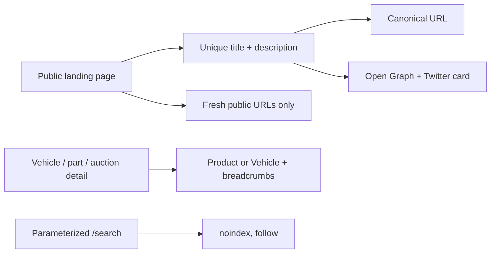
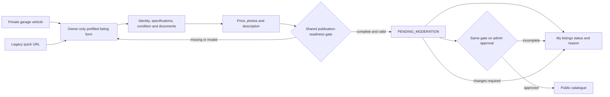
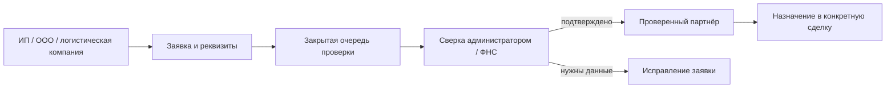
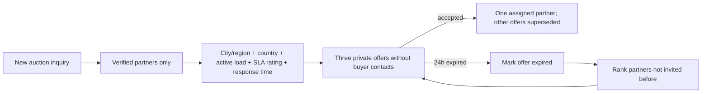

# LeWheel project graph

Read this file before broad searches. Follow only the branch needed for the
current task and update the graph when ownership or data flow changes.

## Runtime graph

## Task routing graph

| Task | Start here | Then inspect |
|---|---|---|
| Auction catalogue UI | `src/app/auctions/page.tsx` | `src/app/api/auctions/route.ts`, auction components |
| Auction detail and galleries | `src/app/auctions/[id]/page.tsx` | `src/lib/auction-media.ts`, source collector |
| Unified auction source fields | `src/lib/auction-source-details.ts` | `auction-import.ts`, detail page |
| Interactive damage report | `src/components/auctions/AuctionDamageReport.tsx` | `auction-damage.ts`, source inspection adapter |
| Admin analytics and charts | `src/app/admin/page.tsx` | `src/app/api/admin/stats/route.ts`, analytics visit route |
| Campaign/button analytics | `src/components/analytics/AppAnalytics.tsx` | visit API, admin traffic API and traffic dashboard |
| Admin decision audit | `src/components/admin/AdminAuditLog.tsx` | `src/app/api/admin/audit/route.ts`, `src/lib/admin-audit.ts`, mutating admin routes |
| Auction source health | `src/app/api/admin/auctions/stats/route.ts` | `auction-crawl-policy.ts`, admin sources tab |
| Shared site navigation | `src/lib/navigation-registry.ts` | header, footer, app shell, dashboard and Telegram shell |
| Website authentication | `src/app/auth/` | `src/app/api/auth/`, NextAuth configuration |
| Telegram registration | `scripts/telegram-polling.mjs` | Telegram API routes and user model |
| Private account details | `src/app/api/users/[id]/route.ts` | dashboard profile workspace, authenticated audit |
| Unified URL search | `src/app/search/page.tsx` | `HomeCatalog.tsx`, `/api/listings` query contract |
| Auction import | source collector | parser sync/refresh route, `auction-import.ts` |
| Exchange rates | `src/lib/exchange-rates.ts` | CBR refresh script and cron |
| Freshness/removal | source refresh route | `auction-crawl-policy.ts`, `auction-source-freshness.ts`, listing status fields |
| Production schedule | `scripts/run-encar-collector.sh` | cron installer and deployment script |
| Delivery partner onboarding | `src/app/api/delivery-organizations/route.ts` | delivery workspace, admin partner registry |
| Auction partner routing and SLA | `src/lib/auction-partner-routing.ts` | `partner-scoring.js`, offer API, hourly SLA cron |
| Garage to moderated listing | `src/app/api/garage/route.ts` | dashboard garage, vehicle creation workspace |
| Vehicle publication readiness | `src/lib/vehicle-publication-readiness.ts` | full vehicle form, owner resubmission/edit API, listing creation API, admin approval |
| Search metadata and structured data | `src/app/layout.tsx` | route layouts, `StructuredData.tsx`, sitemap/robots/manifest |
| SEO landing metadata | `src/lib/seo-metadata.ts` | category generator and public route layouts |
| iAutos gallery relay | `src/app/api/auction-media/route.ts` | `media-url.ts`, detail gallery |

## Auction ingestion graph

Discovery still scans bounded catalogue pages every 20 minutes so new source
IDs enter immediately. Detail pages already confirmed in the database use a
12–24 hour source-specific cooldown. Availability refresh is separate and uses
3–12 hour source-specific intervals; two spaced missing checks are required
before a listing is hidden. Photos remain source CDN URLs and image binaries are
not persisted in the application database or server filesystem. The iAutos CDN
is unreachable from some client regions, so only its four fixed image hosts use
a bounded, cached, allow-listed relay; bytes are streamed through memory and are
never written to disk.

The serialized collector retries short loopback failures within a 30-second
budget. A source stage that reaches its four-minute timeout is recorded once
and is not replayed by curl, keeping the shared deploy/collector lock bounded.

Structured inspection sources use the shared `AuctionDamageReport` payload.
Native Russian source labels are kept first; deterministic source dictionaries
are used next, and untranslated foreign prose is never published. Only defect
text, normalized coordinates and allow-listed HTTPS URLs are stored. Diagram
and defect image bytes load on demand from the source into the browser cache.
The detail widget navigates across every defect photo in the active inspection
section, even when the selected defect itself has only one photo. Imported and
legacy lots both render the same ordered source-detail table. Known database
columns fill canonical rows first, translated source attributes enrich them,
and an unavailable source value is stated explicitly instead of changing the
layout by country. The browser decodes only the active full-size photo and one
card-size neighbour; long galleries render a moving window of thumbnails. The
iAutos relay streams validated bytes as they arrive instead of buffering the
whole image, while enforcing the same host, MIME, timeout and size limits.
The admin source-health matrix uses each source's own refresh interval. It
separates stale public lots, first-stage removal checks and automatic quality
holds, so parser failure is distinguishable from moderation and delisting.

## Account and search graph

The public user response remains limited to id, name and avatar. Only the
profile owner or an administrator receives verified contact fields, role,
registration channel and account creation time. Search query parameters are
passed into the catalogue as keyed initial state so route-to-route navigation
cannot leave a stale make or text query behind.

## Administrator decision audit graph

The shared journal covers account roles and restrictions, personal
notifications, listing moderation and removal, complaints, partner company
verification, auction inquiry assignment and status changes, support actions,
Telegram broadcasts, auction visibility, part-store moderation and referral
payouts. Message bodies, buyer contacts and partner contacts are deliberately
excluded from summaries and metadata. Failed actions are not written; a
journal write failure is logged but does not replay an already completed
external action such as a Telegram broadcast.

## SEO graph

Category and service landing pages are indexable and use route-specific search
intent. Parameterized internal search stays crawlable for link discovery but
is not indexed, preventing duplicate result pages from diluting canonical
category pages. Fonts use the local system stack, so server rendering and
production builds never depend on a third-party font request.

## Personal listing workflow

The garage endpoint can return one selected vehicle only when it belongs to the
current user and remains in the private garage category. Creating an advert
still creates a new transport record and listing atomically; it never publishes
the private garage record directly. The legacy quick URL redirects into the
full form. Creation, owner resubmission and edit, and administrator approval all
use the same readiness contract, so incomplete vehicles cannot enter or leave
the moderation queue through an alternate endpoint.

## Source inventory

| Region | Source | Pipeline | Operational entry point |
|---|---|---|---|
| Korea | Encar | Public collector | `/api/parser/encar/*` |
| Korea | K Car | Public collector | `/api/parser/kcar/*` |
| Korea | Bobaedream | Public HTML collector | `/api/parser/public/BOBAEDREAM/*` |
| China | Iautos | Public HTML collector | `/api/parser/public/IAUTOS/*` |
| China | YouXinPai export | Public storefront JSON + structured inspection collector | `/api/parser/public/YOUXINPAI/*` |
| Japan | Goo-net Exchange | Public HTML collector | `/api/parser/public/GOONET/*` |
| Japan | BE FORWARD | Public sitemap and HTML collector | `/api/parser/public/BEFORWARD/*` |
| Japan | CarSensor | Public sitemap and HTML collector | `/api/parser/public/CARSENSOR/*` |
| Europe | Carvago | Public HTML collector | `/api/parser/public/CARVAGO/*` |
| Europe | AutoSale | Public sitemap and JSON-LD collector | `/api/parser/public/AUTOSALE/*` |
| Europe | mobile.de | Official API when credentials exist | `/api/parser/mobile-de/*` |
| Other configured sources | Registry entries | Partner feed / official API | `/api/parser/partner-feeds/sync` |

## Source admission checklist

1. Public catalogue and detail pages must be available without login or CAPTCHA.
2. Respect the source's robots policy and do not bypass access controls.
3. Use a bounded serial request rate and the configured proxy pool only.
4. Require stable source ID, price, year, make/model and at least one real photo.
5. Reject customer-visible CJK text unless deterministic localization or a
   verified Russian translation succeeds.
6. Store source currency and use the current CBR snapshot for RUB pricing.
7. Implement both discovery and two-confirmation freshness checks.
8. Add the source to the registry, cron, production health query and this graph.

## Delivery partner verification graph

Подача заявки не назначает компанию на доставку и не открывает ей чужие
сделки. Пользователь видит только собственную заявку; решение фиксируется в
существующем администраторском реестре. Автоматическая отметка ФНС допустима
только после ответа подтверждённого источника, иначе используется ручная
проверка.

## Auction partner offer and SLA graph

The API and the hourly Node cron import the same pure scoring module, so an
interactive assignment and a scheduled retry cannot rank the same partner in
different ways. An expired offer never reveals buyer contacts and never returns
to a partner already invited for that inquiry. Arbitration remains a separate,
unfinished business workflow and is not implied by SLA reassignment.
